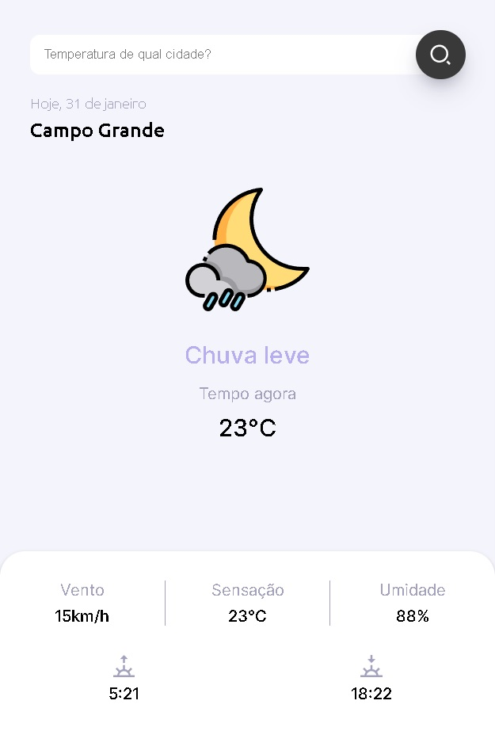

<h1 align="center"> Snapclima </h1>

O Snapclima busca a localização do usuário em tempo real e mostra as condições climáticas dessa localização, com base em uma API externa. Também é possível buscar as condições climáticas de qualquer cidade do mundo, também em tempo real.  

  <a href="#-tecnologias">Tecnologias</a>&nbsp;&nbsp;&nbsp;|&nbsp;&nbsp;&nbsp;
  <a href="#-projeto">Projeto</a>&nbsp;&nbsp;&nbsp;

 

  

## 🚀 Tecnologias

Esse projeto foi desenvolvido com as seguintes tecnologias:

- HTML e CSS
- JavaScript
- Git e Github

## 💻 Projeto

O projeto é destinado ao estudo e ao conhecimento das condições climáticas, em tempo real, de qualquer cidade do mundo.

- [Visite o projeto online](https://brunanasser.github.io/snapclima)
